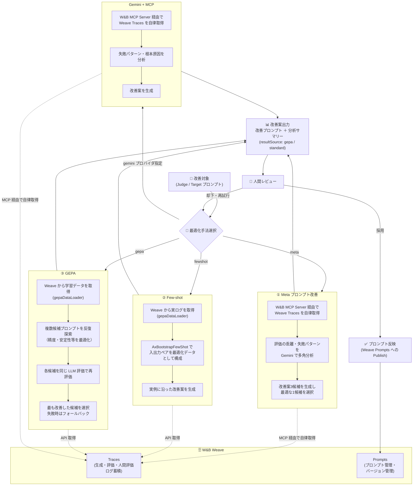

# Weave Hackathon

## 課題仮説

### 解決する課題

1. エージェントを構築するには、ドメインエキスパートが評価基準を明文化して、プロンプトとしてLLMが理解できる形で与える必要があるが、実際には「経験的に良い」や専門的でLLMが理解できない、微妙な基準をLLMへの指示に落とし込むことが難しいことで、エージェントの改善が進みにくい
2. （サービスによっては）一般的なフィードバック機能は、良し悪しの2択で何が良くて何が悪いか曖昧だったり、コメントを追加する機能があっても書くのが面倒で適切なフィードバックが与えられなかったりすることが多く、継続的な改善に利用しにくい
3. エキスパートも別業務があるので、継続的な改善のためにエキスパートに多大な協力を求め続けるのは難しい

### 解決方法

**ドメイン知識を資産化し、継続的に進化するAIエージェント運用基盤**

- ドメインエキスパートのフィードバックを分析して、文章生成エージェンとと評価エージェントのプロンプトを改善する機能を作成する
- この機能を「調整エージェント」と呼ぶ

### 技術的仮説

1. 調整エージェントは汎用プロンプトで構築可能
    1. フィードバック → 改善点抽出 → 指示改善という構造はドメイン依存ではないため、汎用的に設計できると予想
2. ドメイン知識はデータから抽出可能
    1. ドメイン知識は明示的に与えなくても、ユーザー入力、評価結果、プロンプト履歴から再構成できると予想

### 価値

- ドメインエキスパートの継続的な負担を最小限にしつつ、ドメインエキスパートが持っている暗黙知をエージェントに反映させて、顧客体験が向上する